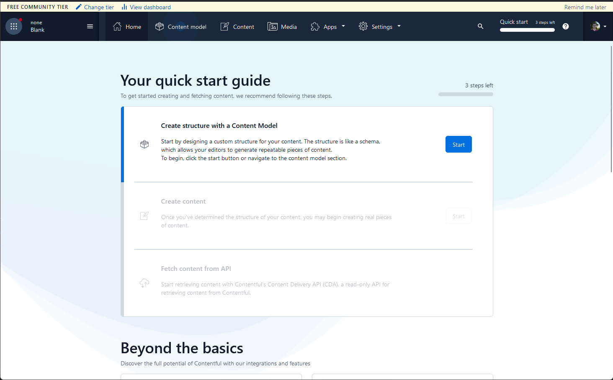
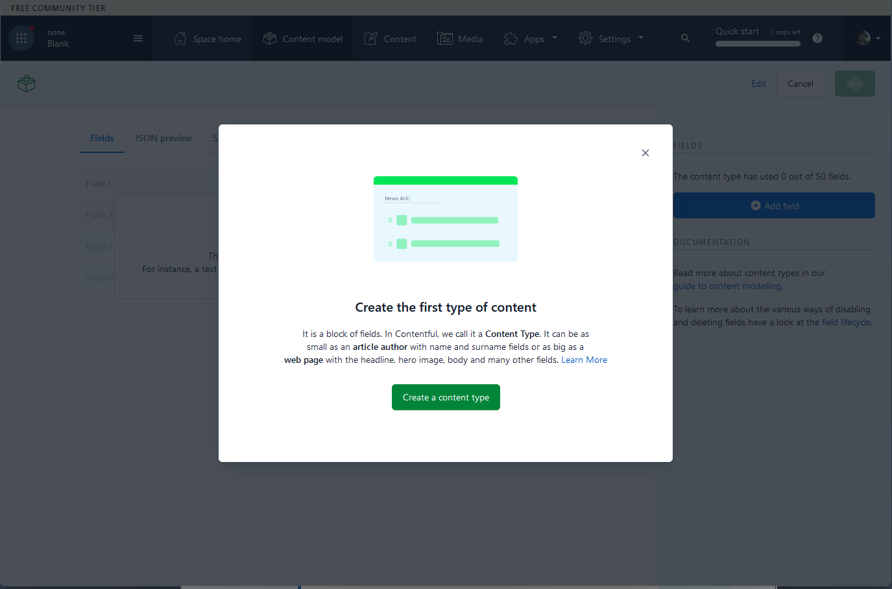
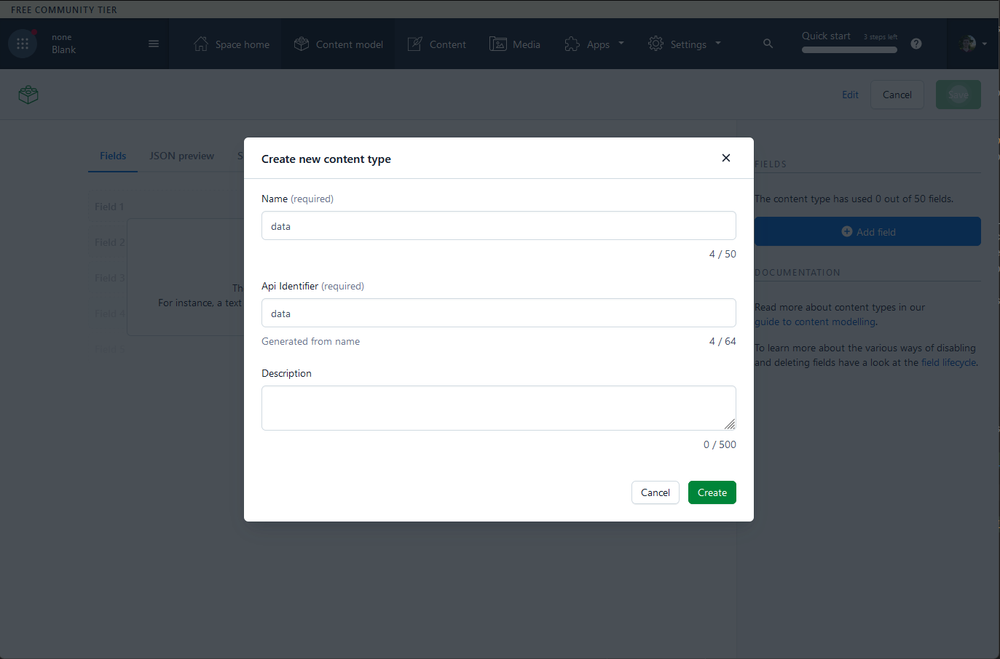
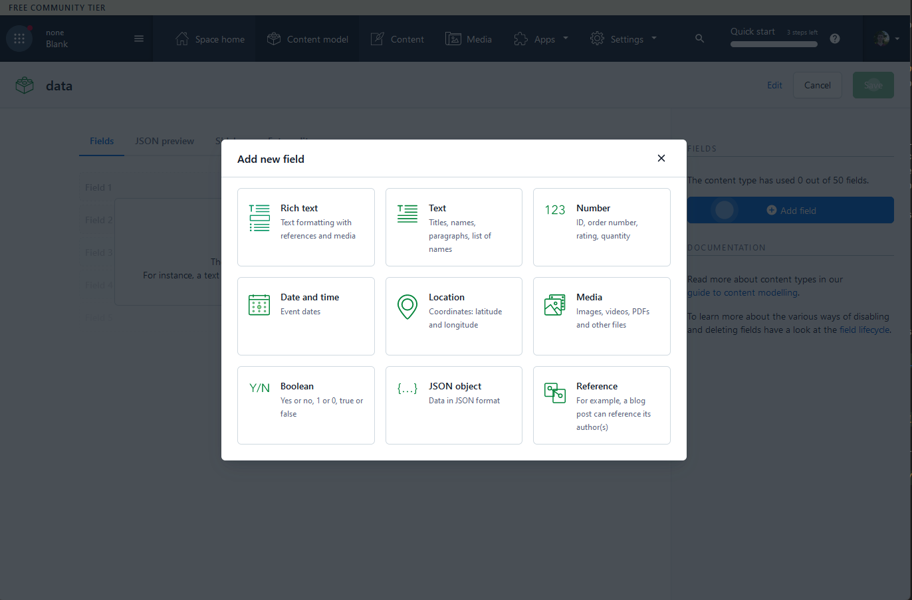
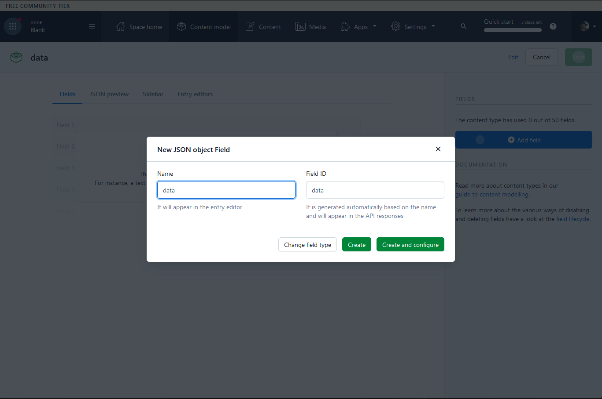
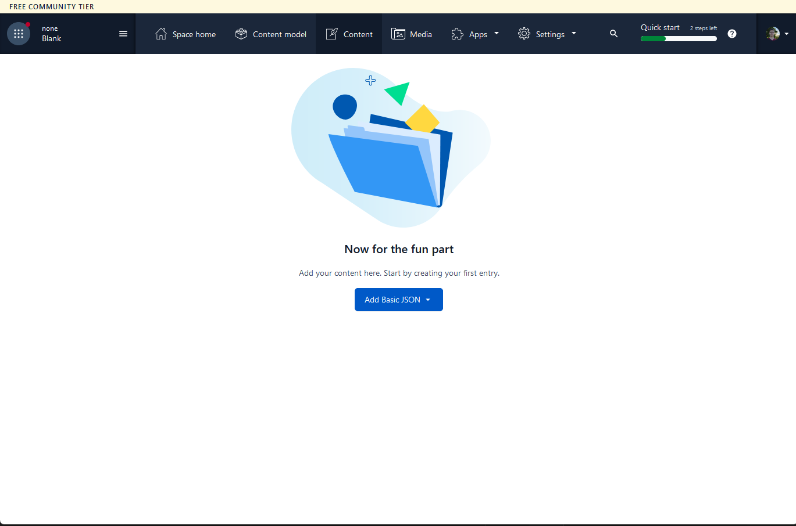
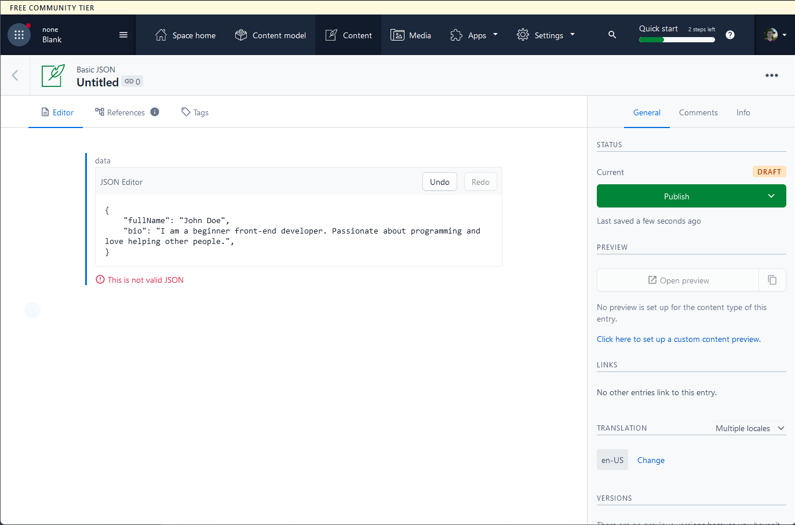
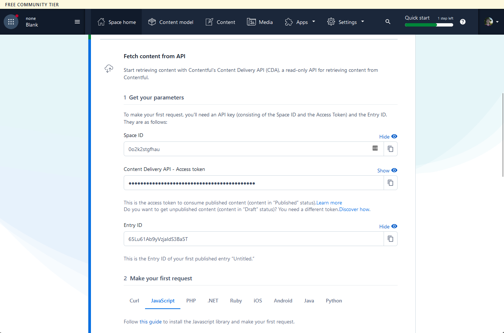

## What you will learn

- How to integrate third party APIs into your front-end
- How to build a personal website of any shape with no back-end work
- What CMS is
- What MACH is

## Let's start with the simplest topic - CMS

CMS stands for Content Management System. It's a some sorts of system which allows users to store and manipulate data
of different formats.

Why it's important to us? We want to showcase our experience with the HRs and potential employers.
To attract more attention it's better to have a cool website to show your future employers so that they can see
you can do stuff even before an interview starts.

In this project we will be using [Contentful](https://www.contentful.com/) which has a plan for free which is exactly
what we need. Also, it supports a wide range of content including JSONs which makes it versatile.

## [MACH](https://machalliance.org/)

MACH stands for Microservices based, API-first, Cloud-native SaaS and Headless. This means that companies build APIs
that solve some problems (e.g. Contentful solves content management problems). These APIs don't have any UIs that you
have to use to display data to your users which means that your website can look to your likes. Also, these can be
integrated into your back-end services to follow businesses needs.

Looks like in the future developers will more construct services around external APIs instead of spending hours of
hardworking developing common case software.

## Setting up Contentful

First of you will need an account. Proceed to the [sign up page](https://www.contentful.com/sign-up/) and create an account.
It's completely free.

Once you sign up you will see the next page. Press the "Start" button.



On the next screen you will be prompted to create first content type. Press the "Create a content type" button.



### Configuring our first content model

Content model is a custom format of data that you can store in the Contentful. There are such types as:
- HTML rich editor
- JSON
- Media files

For now, we will keep it simple as for a personal website we don't need too much. We will create a following data
structure for us to represent ourselves to the world.

You can have multiple content types. You can think of it as of sets of data fields. Each set defines a shape which then
will be followed when new content is created for this type.

Now enter a name of your content type. The identifier will be generated for you.



Save it and click "Add a field" in a new modal.

To work with the contentful you will need to define data structures which consist of different fields. Each field can have
its own type.

In the new modal you will be able to chose the desired data type. Choose the "JSON object" option.



Now name your field in the model and click "Create". Then click "Save". Now you have finished your first content type.
It's time to add the data!



Navigate to the "Content" page (in the header navigation).

### Adding content



This is your main page to add the content to your website or change the existing one. It has a handy interface and enables
you skip creation of admin panel as your content team can use this interface to work with the content. If you need your
own UI you could use [the API](https://www.contentful.com/developers/docs/references/content-management-api/).

The blue button now doesn't show you the drop-down as we only created one content type. Click it.

This is the page where you will edit the content. Since we created just one field "data" of type JSON object we see only
one field and it's a JSON editor. It does some basic validation so that you don't publish invalid JSON to your users.



Above the green button you can see the "Draft" status which means that changes have been saved and you won't lose your
work in case some error occurs. Now "Publish". Congratulations, you have created your first data entry!

### Integrating with the front-end

After you have created the entry you will be taken to the "Space home" page. Here you will need the "Space ID" and
"Content Delivery API - Access token" for your client to have the access to the data.



Normally, you would want to make these requests from the backend to limit what data is accessible by the users, but since
we are building a very simple website with no private data we are completely save using it right on the front-end side.

Chose the "JavaScript" option and proceed to the docs. They come to `npm install contentful` and

```
const contentful = require("contentful");
const client = contentful.createClient({
  // This is the space ID. A space is like a project folder in Contentful terms
  space: "developer_bookshelf",
  // This is the access token for this space. Normally you get both ID and the token in the Contentful web app
  accessToken: "0b7f6x59a0"
});
// This API call will request an entry with the specified ID from the space defined at the top, using a space-specific access token.
client
  .getEntry("5PeGS2SoZGSa4GuiQsigQu")
  .then(entry => console.log(entry))
  .catch(err => console.log(err));
```

The entry ID is the unique ID of each item you create in the "Content" page. You can easily find it by opening the
entry editor and looking in the URL `https://app.contentful.com/spaces/0o2k2stgfhau/entries/65Lu61Ab9yVzjaIdS3Ba5T`. The
part that comes after the `entries/` is your entry ID.

Put your space, access token and entry ID in the snippet above. You should get response similar to this.

```
{
  "metadata": { ... },
  "sys": { ... },
  "fields": {
    "data": {
      "fullName": "John Doe",
      "bio": "I am a beginner front-end developer. Passionate about programming and love helping other people.",
      "skills": [
        "JavaScript",
        "HTML",
        "CSS",
        "RestAPI"
      ]
    }
  }
}
```

The "fields" property contains all created fields and their data.

The only thing left is for you to build the UI and shape the JSON to your likes.
